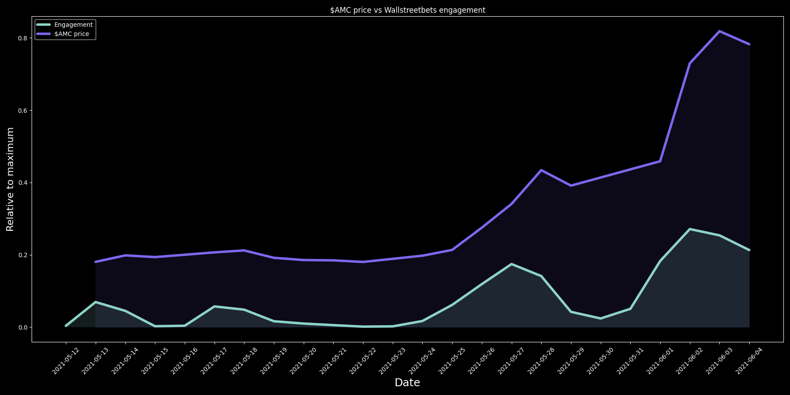
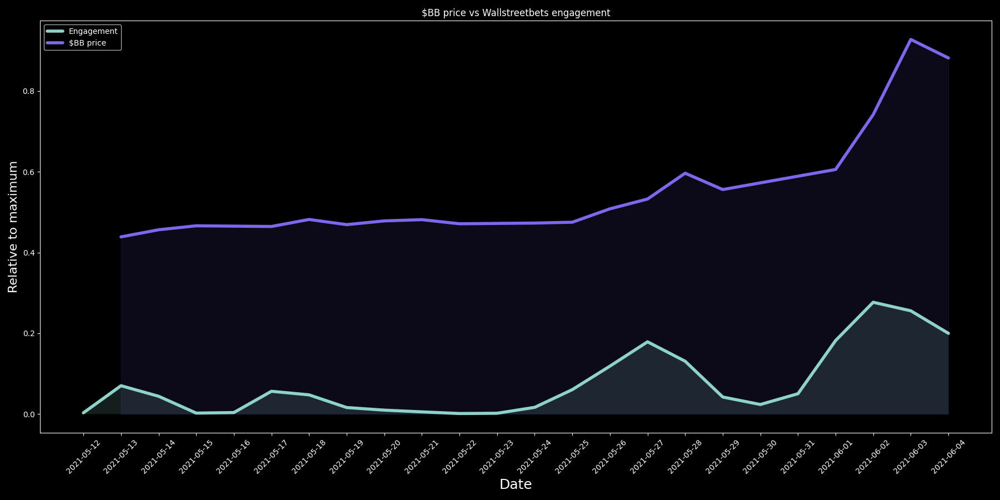
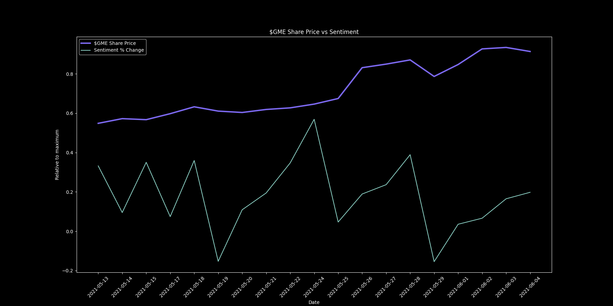
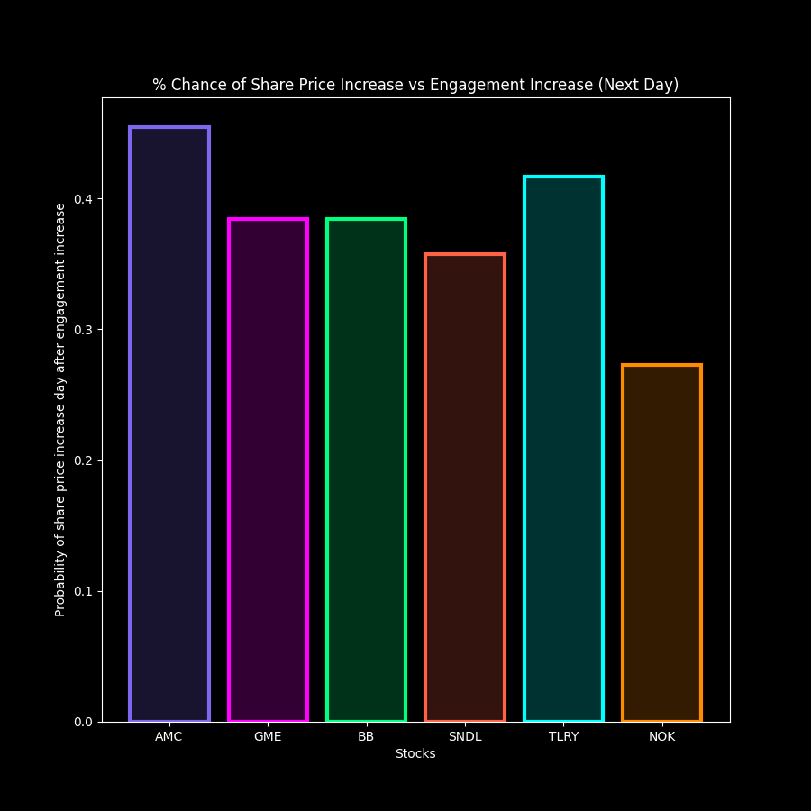

# Analysis of WallStreetBets "Meme Stocks"

### Proposition 

The Subreddit known as [WallStreetBets](https://www.reddit.com/r/wallstreetbets/) is notorious for being behind large rallies in various stocks. Most of these rallies are caused by short squeezes, which can be read more on [here](https://www.investopedia.com/terms/s/shortsqueeze.asp). 

## EDA

The goal of this project is to analyze the activity on the WallStreetBets Subreddit and compare it to the price action of the stocks they are talking about. We can also further analyze if there is any true correlation between the activity on the subreddit and the stock price. 

1. **Collecting Data**

- To begin collecting data, I scraped the WallStreetBets Subreddit using the [PushShiftAPI](https://pushshift.io/). The API allowed me to search all comments that mention a specific ticker in a given time period. It would then return data in a JSON format, which I was able to pull using [requests](https://docs.python-requests.org/en/master/). I collected this data on 6 of the most popular "meme stocks": AMC ($AMC), GameStop ($GME), BlackBerry ($BB), Nokia ($NOK), Sundial Growers ($SNDL), and Tilray ($TLRY). The features I collected included the total number of upvotes, comments, as well as the contents of comments, for the the past month. I stored the contents of comments in a seperate directory as most of my EDA was analyzing the engagement, so parsing through text would make this process much longer. Datasets are provided in the data directory. These files were also stored in a JSON format.
- To get stock market data, I used the [MarketStack API](https://marketstack.com/). To query this API, I looked for a specific ticker in a time interval and pulled this data using requests as well. 

2. **Analyzing Data**

- In our dataset, we have two main types of data: engagement and text. Engagement refers to the sum of comments that mention a given stock and the upovotes of that comment. All of the .py files are provided in the src directory. To properly compare the engagement and the share price, I plotted the engagement and share price plots relative to their max and percent change. The data I had stored was initally only for 20-minute intervals rather than daily averages, which was a mistake I made during data collecting, but it did allow me to be more flexible with the frequency of data. 

- The second type of dataset we have is text, which simply means The data it contains is the text content of a comment that mention one of our given ticker symbols. This was needed for the sentiment analysis of the EDA. To analyze the sentiment, I used the [NLTK Sentiment Library](https://realpython.com/python-nltk-sentiment-analysis/). This data was also stored in 20-minute intervals, so I converted the text data into daily averages as well.

## Hypothesis Testing
- **Null Hypothesis:** No statistical correlation between either engagement or sentiment about a stock vs share price of stock.
- **Alternate Hypothesis:** Statistical correlation exists between either engagement or sentiment about a stock vs share price of stock.

## Findings
- Plots can be found in the images directory.

### Correlation between engagement and share price for $AMC
- This graph analyzes the engagement vs the share price on a relative scale.

### Correlation between engagement and share price for $BB
- This graph analyzes the engagement vs the share price on a relative scale.

### Correlation between sentiment and share price for $GME
- This graph analyzes the sentiment vs the share price on a relative scale.

## Results
The main purpose behind the EDA is to see if there is a correlation between the activity on WallStreetBets and the share price of stocks. We are will be testing for 
The Trial 1 Error Rate will be = 0.01 for the T-Test.

### Definitions
- Next Day Correlation - correlation between the engagement on a given day and share price the following day (high correlation = ahead of trend)
- Prev Day Correlation - correlation between the engagement on a given day and share price the of the previous day (high correlation = behind trend)

### Correlation Coefficients - Engagement

- **AMC:** 
  * Same Day Correlation: 0.7836734791979197
  * Prev Day Correlation: -0.095002426197534
  * Next Day Correlation: 0.7522435819173727
  * T-test: 5.141029882342577e-05

- **GME:**
  * Same Day Correlation: 0.7015547092161876
  * Prev Day Correlation: -0.15977934508996347
  * Next Day Correlation: 0.6473196702717451
  * T-test: 2.1902759648971002e-18

- **BB:**
  * Same Day Correlation: 0.7510425096787338
  * Prev Day Correlation: -0.0005532303271056227
  * Next Day Correlation: 0.7172539412716349
  * T-test: 4.196445396871837e-14

- **SNDL:**
  * Same Day Correlation: 0.7200428404381856
  * Prev Day Correlation: -0.07856040160933374
  * Next Day Correlation: 0.6745332953594741
  * T-test: 1.7236621209051704e-16

- **TLRY:**
  * Same Day Correlation: 0.7148534722081824
  * Prev Day Correlation: -0.041808424581382016
  * Next Day Correlation: 0.6758162262791414
  * T-test: 3.989543501641067e-23

- **NOK:**
  * Same Day Correlation: 0.5355591273765817
  * Prev Day Correlation: 0.2730968257985349
  * Next Day Correlation: 0.4012833566220041
  * T-test: 6.1759986290167304e-30

### Conclusion
As we can see from the results, there is a very good correlation between most of the meme stocks and the engagement on the subreddit. Looking deeper into the data, the next day correlation is also relatively high, which shows that the subreddit also tends to be ahead of the trend. Therefore, we fail to reject the null hypothesis.

## More Results
Does this mean you should be taking investment advice based on WallStreetBets? Not necessarily. As shown in the tables below, the probability that the share price will increase following an increase in enagement, which is what is being used as an indicator, is consistenly under 50%.

## Moving Forward
In the making of this project, the stocks mentioned continue their volatile action. The analysis and code can be used in the future for further research. I plan on turning this into a more user-friendly program, one that is more dynamic. I will also do more analysis on what features to look for, possibly finding a different indicator. If this happens, this will be turned into an application where, the application will ping users when it senses a "WallStreetBets indicator"

## Technologies Used
- Datetime
- MarketStack API
- Matplotlib
- NLTK
- Numpy
- Pandas
- PushShift API
- Requests
- Scipy
